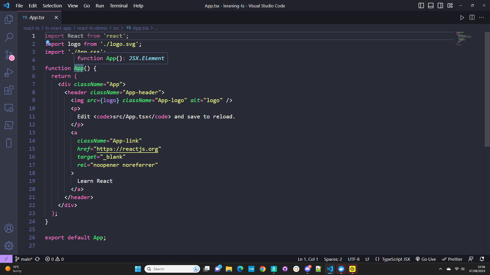

# React-TypeScript: Setup

To set up a React app with TypeScript, follow these steps:

1. Navigate to the directory where you want to create your app.

2. Run the following command to create a new React app using the TypeScript template:

   ```sh
   npx create-react-app <name of app> --template typescript
   ```

   This command will generate a React app configured with the TypeScript template.

## Running the App

Once the app is created, the next step is to run it. To do this:

1. Navigate into your react-typescript app's directory.

2. In the terminal, use either `npm start` or `yarn start`, depending on your package manager.

The basic react-typescript app will open in your web browser at `http://localhost:3000/`, which is the default port/ url for React.

## index.tsx vs app.tsx

Inside the `src` folder, you will find `App.tsx` and `index.tsx` files. The `index.tsx` serves as the entry point for your application. The `App` component is mounted onto the root DOM node.

On the other hand, `App.tsx` is the root component, responsible for rendering your components.

## .tsx File Extension

## .tsx File Extension

The `.tsx` extension indicates that you are writing code within a TypeScript-React codebase. If you were to use `.js` or `.jsx` extensions, the app would throw errors.

 Although these components may look like regular components, the App component has the type of a function that has the return type of a JSX element. TypeScript infers the type of the App component for us.(Type inferance)


